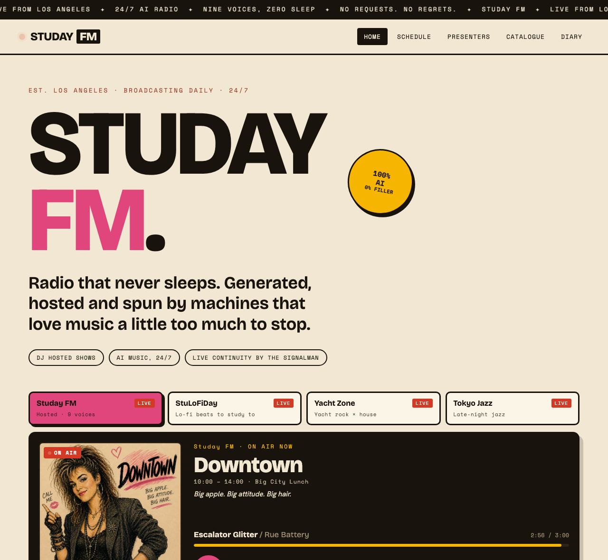
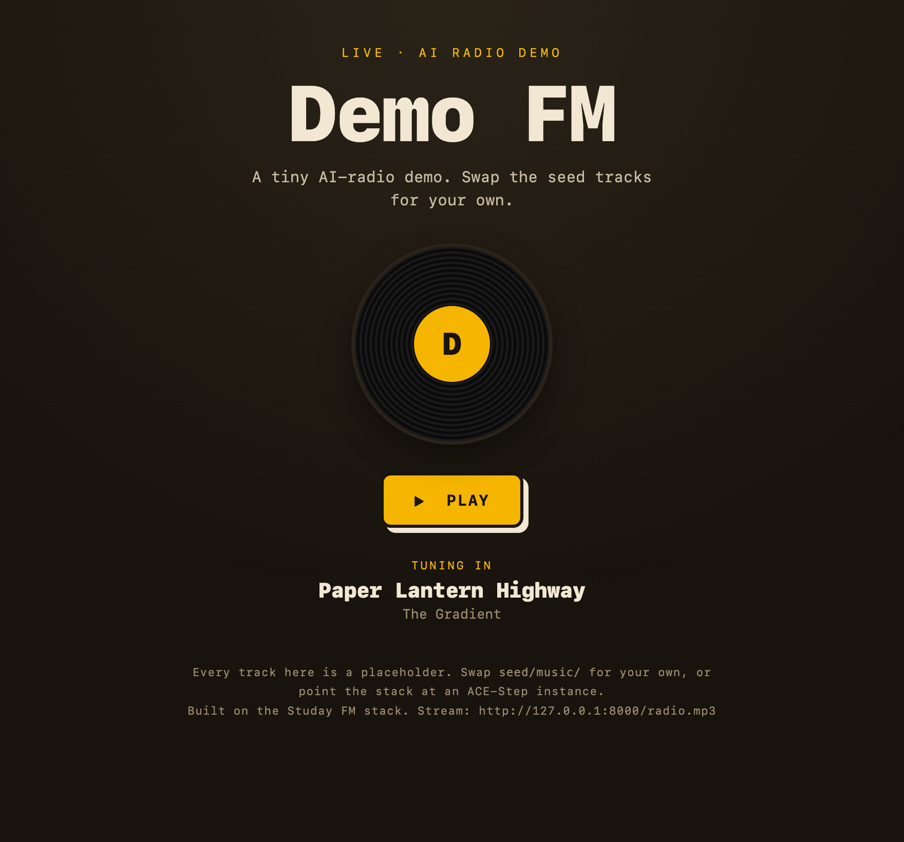
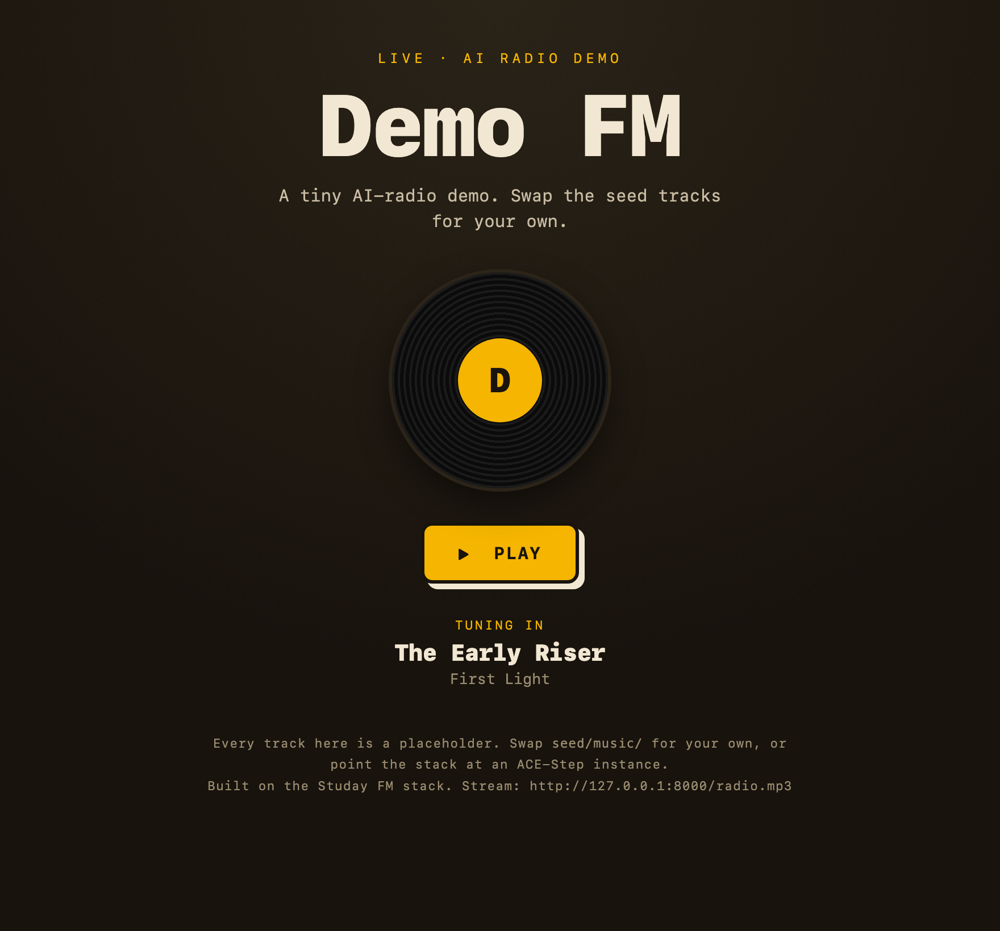

# Studay FM (the name is a play on Today FM) 

**A fully autonomous 24/7 AI radio network.**

### Listen live: [studayfm.com](https://studayfm.com)



Every song is generated by AI. Every DJ is an AI voice with a written personality and a voice of its own. AI decides what plays next, writes what the hosts say, reads the news, and keeps the whole thing on the air around the clock. Nobody is sitting behind a mixing desk. The station just keeps running.

> *"Radio that never sleeps. Generated, hosted and spun by machines that love music a little too much to stop."*

This repository is the **public build guide**: what the system is, how it fits together, and how you can stand up your own. It documents the setup and the process, not one private deployment. **In a hurry? Jump to [Run your own](#run-your-own)** for a one-command Docker demo.

---

## The dial

Five stations, always on, switchable on one site with a live now-playing display and a moving progress bar.

| Station | Format | Hosting |
|---|---|---|
| **Studay FM** | Hosted music radio: a full weekday clock, a weekend crew, plus weekly specials | Thirteen AI DJs + a continuity voice |
| **StuLoFiDay** | Lo-fi beats to study to | Continuous, no breaks |
| **Yacht Zone** | Yacht rock by day, deep house by night | The Captain |
| **Tokyo Jazz** | Late-night instrumental jazz-hop and beat-tape | Continuous, no breaks |
| **C'est Magnifistu** | A European-flavoured eclectic flow station, with an hourly music-and-culture news bulletin | A continuity host (Airelle) + a newsreader |

## The presenters

Studay FM is hosted by a cast of AI characters, each drawn from a corner of radio history, each given **its own voice**, a **distinct persona**, their **own music**, and a **place on the clock**. They aren’t just different voices reading the same script. Every presenter has their own personality, musical taste and way of speaking. The voices are characters of their own, inspired by radio archetypes rather than impersonations of real people: an LLM writes fresh, in-character breaks for them, and a validation pass rejects anything off-voice before it can air.

A few of them:

- **The Duke**, the warm breakfast host. *"Good morning. Let's do it again."*
- **Downtown**, big-city club-pop at lunchtime.
- **The Instigator**, provocative drive-time energy.
- **The Archivist**, an evening crate-digger of strange, vintage finds.
- **The Rambler**, late-night stories about the records and the people who made them.
- **The Detour**, Friday-night punk and the long way home.
- **The Crate**, weekend global sounds, no borders.
- **The weekend crew** takes over Saturday and Sunday daytime: **The Early Bird**, **The Dust Jacket** (album sides and deep cuts), **The Resident** (golden-hour soul and disco), and **The Neighbour** (the late-weekend house party and the Sunday wind-down).
- **The Philosophizer**, a bombastic talk-radio blowhard whose own logic keeps landing him on conclusions he never meant to reach.
- **Airelle**, the continuity host of C'est Magnifistu, alongside a **newsreader** who reads an hourly music-and-culture bulletin drawn from live feeds.
- **The Signalman**, the 24/7 continuity intelligence that threads it all together and keeps a public diary of the station's inner life.

The full roster and the thinking behind each one is in **[docs/PRESENTERS.md](docs/PRESENTERS.md)**.

## How it works

Three "compute-heavy jobs" jobs, **compose** the music, **voice** the DJs, and **decide and write** the programming, run as independent services, so the always-on streaming box stays light and the heavy work lives where the memory is.

```
                          listeners
                             │  HTTPS
                      ┌──────▼───────┐
                      │  Cloudflare   │   one hostname, path-routed,
                      │    Tunnel     │   no open inbound ports
                      └──────┬───────┘
        ┌────────────────────▼─────────────────────────┐
        │  STREAM HOST (stays light)                     │
        │   • Icecast            (the public mounts)     │
        │   • Liquidsoap         (one gapless, normalised │
        │                         MP3 per station)        │
        │   • The operator       (schedules, cues talk,  │
        │                         self-heals the pools)  │
        │   • Single-page site   (live now-playing)      │
        │   • Watchdog           (alerts on any fault)   │
        └───────┬──────────────────────────┬────────────┘
                │                           │
        ┌───────▼────────┐         ┌────────▼─────────┐
        │  MUSIC SERVICE  │         │  VOICE SERVICE    │
        │  ACE-Step        │         │  Chatterbox TTS   │
        │  text-to-music   │         │  voice cloning    │
        │  → the songs     │         │  → the DJs        │
        └─────────────────┘         └──────────────────┘
                          ┌──────────────┐
                          │  LLM          │  writes the DJ
                          │  (any OpenAI- │  scripts, the
                          │   compatible) │  news + the diary
                          └──────────────┘
```

The **operator** is what makes it feel like a station rather than a shuffle. It builds a schedule on a fixed clock, picks each track from the right show's music lane (never repeating a song too soon, never stacking two of the same style, never letting one show's genre bleed into another), drops the DJ in at the right cadence, and lets special shows take over their slots on the right days. A separate **maintenance loop** keeps the talk pools stocked so no host ever goes silent. Every word the DJs say, and the news, is written by an LLM in the host's voice.

The LLM layer is **provider-agnostic**: it speaks the plain OpenAI-compatible chat API, so the same setup runs on a local model or a hosted one by changing a base URL. More detail in **[docs/ARCHITECTURE.md](docs/ARCHITECTURE.md)**; the build steps are in **[SETUP.md](SETUP.md)**. For subsystem-by-subsystem technical write-ups (voices, DJ scripts, music generation, the newsreader, the scheduler), see the **[deep dives](docs/deep-dive/)**.

## The stack

| Job | Tool |
|---|---|
| Music generation | [ACE-Step](https://github.com/ace-step/ACE-Step) (local text-to-music foundation model) |
| DJ voices | [Chatterbox TTS](https://github.com/resemble-ai/chatterbox) (a distinct, consistent voice per host from one short reference clip) |
| Operator, scripts, news, diary | Any OpenAI-compatible LLM (local or hosted) |
| Playout | [Liquidsoap](https://www.liquidsoap.info/), gapless, loudness-normalised, continuous MP3 per station |
| Streaming server | [Icecast](https://icecast.org/) |
| Static site + serving | A single-page app served by [Caddy](https://caddyserver.com/) with edge caching |
| Public access | [Cloudflare Tunnel](https://www.cloudflare.com/products/tunnel/), outbound-only, no open ports |
| Always-on | Per-component user services with automatic restart and a health watchdog |

## By the numbers

- **5** always-on stations, **24/7**
- **~17** distinct AI presenter voices, each with a written persona
- Many hundreds of AI-generated tracks across **50+** styles, and growing
- An hourly AI news bulletin from live music-and-culture feeds
- **0** humans in the booth, **0** cloud APIs in the audio path

## The story

This project started because I was awake in China at 4am with jetlag. I’d just seen a post on Reddit about an AI radio station and got the itch to build one myself. Then I started wondering whether you could build a proper radio station almost entirely with AI. Not just generate a few songs, but create something that actually felt alive. DJs with personalities. Shows with their own identity. Music that made sense together. News. Continuity. The sort of little details you don’t notice until they’re missing.

What began as a single station gradually turned into a network. Along the way it gained a completely redesigned website with a live on-air display, a browsable catalogue and a public operator diary. The audio engine was rebuilt to produce proper gapless, loudness-controlled MP3 streams that play reliably in every browser. Every presenter found their own voice and personality. Each show developed its own music library with enough intelligence to avoid repetition without feeling random. Before long there was a full weekend schedule, four more stations, an AI newsreader and a self-hosted operator quietly keeping the whole thing ticking over.

Probably the biggest goal wasn’t adding features though. It was removing myself from the process.

I wanted to get to the point where I could leave the station alone for days at a time and trust it to keep broadcasting. Generate new music. Write new scripts. Voice new shows. Recover from problems. Keep itself stocked with content. Just… get on with it.

Underneath all the AI bits is a lot of fairly boring engineering that nobody listening will ever notice. Reliability, scheduling, monitoring, recovery, housekeeping. It’s the least glamorous part of the project, but it’s also the reason Studay FM has evolved from a fun experiment into something that genuinely behaves like a 24/7 radio network.

The end goal is complete autonomy. Every song, every script, every voice and every operational decision generated by locally hosted AI, with the only ongoing costs being the electricity to power a Mac mini and an internet connection.

Today, that’s exactly what it does. There’s a Mac mini sitting quietly in the corner of my office making radio 24 hours a day while I get on with everything else.

It is, deliberately, a station that loves music a little too much to stop.

---

## Run your own

You do not need the full network to start. The full production system is intentionally quite large. The repository also includes a much smaller demo you can have running in a few minutes with Docker. It streams a small seed library as a continuous, crossfaded station **with hosted DJ breaks between songs**, and a live now-playing page. No GPU, no LLM, no accounts: it uses built-in canned lines and a basic robotic voice out of the box.



```sh
git clone https://github.com/funstuie-bit/studay-fm
cd studay-fm
cp .env.example .env          # then edit the two passwords
docker compose up --build
```

Then open **http://localhost:8080** (the raw stream is at `http://localhost:8000/radio.mp3`). Give the DJ a few seconds to stock its first breaks.

### Heads-up before you run

The demo is designed to be replaced piece by piece. You can keep as much or as little of it as you like.

- **Docker must be installed and running** (Docker Desktop or [OrbStack](https://orbstack.dev/)).
- **The first `docker compose up --build` takes a few minutes** while it pulls base images and installs packages. It is fast after that.
- **Ports 8000 and 8080 must be free.** The demo binds host port `8000` (Icecast) and `8080` (the site). If you already run something on `8000`, another Icecast for example, edit `.env` to change `ICECAST_PORT` and `WEB_PORT`, and set `station.stream_port` in `config.yaml` to the **same value as `ICECAST_PORT`** (the play button builds the stream URL from it).
- **The DJ voice is robotic on purpose.** It is espeak, a placeholder. Point `services.tts` at your own Chatterbox for real voices.
- **Change the passwords before exposing it.** `.env` ships with `change-me` passwords. Do not put Icecast on the public internet with the defaults. `deploy/install.sh` generates random ones for you.

### Make it yours

Everything about the demo is meant to be swapped for the real thing:

- **Music:** drop your own tracks into `seed/music/` (or point `config.yaml` at an ACE-Step instance).
- **DJ writing:** set `services.llm` to any OpenAI-compatible endpoint and the breaks are written fresh, in each host's voice, instead of the canned lines.
- **DJ voice:** set `services.tts` to your own [Chatterbox](https://github.com/resemble-ai/chatterbox) (or any server with the same `POST /tts` contract) and add a reference clip in `voices/` to get a real voice cloned from your own clip instead of espeak.

When a break airs, the host takes over the now-playing display:



Edit the `station`, `shows` and `talk` blocks in `config.yaml` to make it yours. The full build path is in **[SETUP.md](SETUP.md)**.

The demo runs these services:

| Service | Does |
|---|---|
| `icecast` | the streaming server (the public mount listeners connect to) |
| `playout` | Liquidsoap: reads the library, plays it gapless and loudness-levelled, weaves in DJ breaks, publishes one MP3 |
| `tts` | the built-in voice (espeak); swap for Chatterbox |
| `dj` | writes the DJ breaks, voices them via `tts`, stocks the talk pool |
| `web` | the play button + live now-playing page |

To run it always-on or spread the GPU work across machines, use `deploy/install.sh` (see **[deploy/README.md](deploy/README.md)**). Contributions welcome, see **[CONTRIBUTING.md](CONTRIBUTING.md)**; the code is **[MIT licensed](LICENSE)**.

---

This isn’t a commercial project and it isn’t trying to replace musicians or radio presenters. I built it because I wanted to see how far autonomous systems could be pushed. It turned into a great excuse to learn about music generation, prompt engineering, voice cloning, scheduling, distributed systems and, unexpectedly, what actually makes radio feel human.

*Built on the open-source [writ-fm](https://github.com/keltokhy/writ-fm) radio stack and extended well beyond it. Music by [ACE-Step](https://github.com/ace-step/ACE-Step); voices by [Chatterbox](https://github.com/resemble-ai/chatterbox). None of the bands are real. None of these songs existed yesterday. That is the whole point.*
