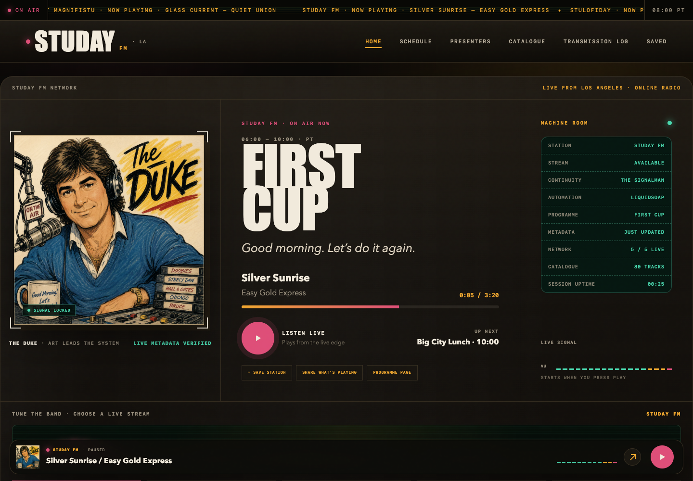
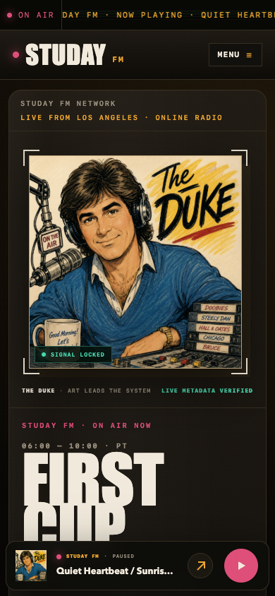
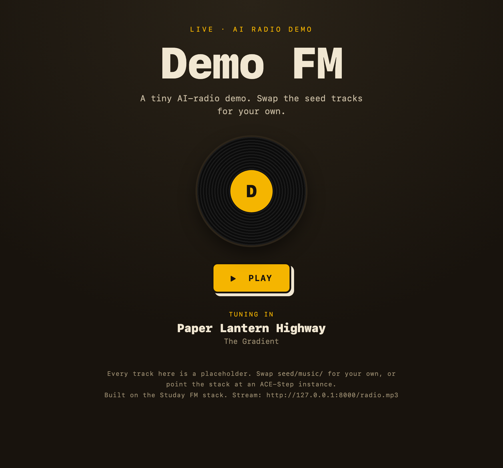

# Studay FM

**A hobby project building towards a fully autonomous, AI-managed radio network.**

### Listen live: [studayfm.com](https://studayfm.com)



Studay FM began as a hobby and is meant to stay fun. It schedules and streams
music around the clock, writes presenter links, renders character voices,
publishes live station data, and monitors the broadcast. The destination is a
station whose programming, production and routine management are genuinely run
by AI, with the owner retaining an emergency stop and setting the creative intent.

Today the station is highly automated, but it is not yet fully autonomous.
Security-sensitive and irreversible actions remain owner-controlled while the
automation earns broader authority. Those controls are transitional scaffolding,
not a change to the goal. New work should make the station sound better, require
less routine intervention, improve reliability, or make the hobby more enjoyable.

This repository is the **public home of Studay FM**. It presents the live project,
its current design and the parts of its architecture that can be shared without
publishing credentials, voice references, operational state or the private media
library. The existing Docker demo remains available for now, but a reusable
build-your-own AI radio station will become a separate project and repository.
See the [project direction and roadmap](ROADMAP.md).

## The dial

| Station | Format | Presentation |
|---|---|---|
| **Studay FM** | A full weekday clock, weekend crew, and weekly specials | Character DJs plus continuity |
| **StuLoFiDay** | Lo-fi beats for work and study | Continuous, no regular breaks |
| **Yacht Zone** | Yacht rock by day, deep house by night | The Captain |
| **Tokyo Jazz** | Instrumental jazz-hop and beat-tape | Continuous, no regular breaks |
| **C'est Magnifistu** | European-flavoured eclectic flow | Airelle continuity plus a sourced music-and-culture bulletin |

The five outputs are independent Liquidsoap graphs publishing continuous MP3
streams to separate Icecast mounts. A failure on one dial can be diagnosed and
recovered without restarting the others.

## The public receiver

The live site uses one receiver-style interface across Home, Schedule,
Presenters, Catalogue, Transmission Log, Saved and programme pages. The dial,
ticker, current programme, artwork, progress and persistent player all follow
the five real station feeds and mounts.

Listener features include Media Session metadata, native sharing with a copy
fallback, Pacific or browser-local schedule times, browser-local favourites,
shareable programme pages, calendar reminders, five-station recently played,
daily catalogue discoveries and an installable app shell. Preferences stay on
the listener's device. There is no listener account or analytics profile, and
live data and audio are never served from the offline cache.



## The presenters

Studay FM uses fictional presenter characters with separate briefs, music lanes,
speech patterns, artwork, schedules, and reference-conditioned voices. They are
not different voices reading one generic script: the writing layer selects a
character-specific segment and validates the result before it enters the render
pipeline.

The voice workflow used one accepted adaptation per character. It did not
iteratively tune outputs to increase resemblance to a named inspiration. Later
pitch, EQ, timing, compression, and loudness work shaped station characters; in
the news workflow the resulting voice moved farther from its inspiration.
Technical filenames or old implementation comments are not evidence of
soundalike intent. Reference rights and provenance still need to be recorded
independently, regardless of resemblance.

The full fictional roster is in
[docs/PRESENTERS.md](docs/PRESENTERS.md). The public guide does not distribute
the private source clips.

## How the production design fits together

```text
                                  listeners
                                      |
                           HTTPS through a named tunnel
                                      |
                  +-------------------+-------------------+
                  |                                       |
             mount allowlist                         site allowlist
                  |                                       |
          loopback Icecast                         loopback Caddy
                  |                                       |
       five Liquidsoap playouts                 static app + live JSON
                  |
       speech-safe schedules and now-playing state
                  |
       approved-media manifests only
                  |
        +---------+----------+
        |                    |
   private queue       scheduled producers
        |                    |
   ACE-Step music      Chatterbox speech
        +---------+----------+
                  |
       candidate -> fixed review policy -> technical QA -> approved

  watchdog -> atomic readiness -> typed station capability broker
                                      |
                  observe | owner-authorized action | policy repair

  local track-aware presenter writer -> speech QA -> exact talk/track pairs
  separate programme-director shadow -> reviewed proposals only
```

The core safety property is **approved-only playout**. A generated file is not
eligible merely because it exists or because its sidecar says `approved`.
Publication also requires current technical QA tied to the file's identity. The
approval source depends on the subsystem: flagship music has an explicit owner
taste-review path, while recurring speech, continuity, flow refreshes, and news
use fixed owner-configured validators. A model cannot approve by calling a tool.
A single locked publisher rebuilds the watched manifests atomically, so
Liquidsoap sees either the previous complete list or the next complete list,
never a half-written playlist.

Speech has an additional playout invariant. On each station, presenter talk,
continuity, and bulletins share one deterministic arbiter: only one voice item
can be selected at a time, and a complete music track must play before another
voice item becomes eligible. Spoken assets carry conservative lead and tail
padding, and voice endings are not crossfaded into the following event. A missed
hour marker or unavailable link falls through to music instead of stacking
voices or clipping a final word.

Runtime JSON follows small validated contracts. Now-playing, schedules, diary,
catalogue, watchdog state, and readiness are written by temporary-file replace
with a durable flush. The flagship readiness endpoint fails closed when the
watchdog evidence is missing, invalid, red, or stale.

Expensive generation is serialized through a private, typed queue. Jobs store an
argv array rather than a shell command, carry bounded attempts and timeouts, and
use a lease plus exit receipt so a worker restart does not duplicate a live GPU
job. Queue mutation remains outside general model access. A narrow capability
broker can execute a small allowlist of reversible actions after an explicit
owner instruction, with typed arguments, exact-target checks, receipts and an
audit trail.

## The model boundary

Text generation speaks an OpenAI-compatible API, so writing tasks can use a
local model or a hosted provider. The local path is reached through an
authenticated, loopback-only, inference-only gateway. It exposes only the
required bounded generation route for an allowlisted model; model-management,
pull, delete, filesystem, and raw administration routes are not forwarded.
That interchangeability does not grant the model operational authority.

The goal remains a fully autonomous AI station manager. The model can inspect a
typed station view. When the owner gives a direct instruction, a separate broker
may authorize one narrowly defined, reversible action such as retiring the exact
track currently identified by the station. The broker, not the model, validates
the target, applies policy and records the result. It provides no shell,
arbitrary filesystem, deployment or unrestricted service-control access.

One repetitive repair path can also run without a fresh owner message, but only
after repeated matching evidence and only for a pre-approved idempotent repair.
This is deterministic policy automation rather than free-form model authority.

Fourteen flagship presenters now have a bounded local track-aware writing route.
The writer receives one exact approved record and produces candidate text only.
After speech and technical QA, the accepted link stores hashes for both the
music and its sidecar. Scheduling and live selection verify those hashes and
keep the link plus named record together as one pair. A changed or retired track
drops the link and music continues. The presenter model cannot approve media,
edit a schedule or control playout.

A separate programme-director shadow still receives the real current show,
recent history and an approved shortlist, then proposes exact assets and speech
decisions against a strict schema. Those proposals remain review-only and do
not alter live playout. Presenter writing has therefore advanced to a guarded
live role while the broader station controller has not.

## The local operations agent

Production also has an interactive local operations agent for routine station
work. It runs through the Pi coding-agent harness against an owner-hosted Qwen
model, so normal audits, planning and maintenance conversations do not require
a metered cloud model. It is an engineering operator rather than an on-air DJ:
it does not write live continuity or independently choose what listeners hear.

The agent has three deliberately separate modes:

- **Audit** can inspect bounded station health, current tracks, schedules,
  catalogue state, review packages and generation-worker availability.
- **Plan** can turn an exact request into a dry-run design without changing the
  station.
- **Maintain** can prepare private generation batches, build review and naming
  packages, run existing tested import procedures and perform routine repairs
  after an exact owner instruction.

Typed observation tools keep model context small and remove private paths from
ordinary results. The client starts with a minimal environment, records guarded
actions, and requires an interactive confirmation before any shell command.
Destructive Git operations, credential access, privilege escalation, package or
network changes, host power actions and public pushes are blocked. Source work
is isolated from the live runtime checkout and still passes the normal tests and
protected review workflow before deployment.

An owner's exact instruction is the approval for that exact operation; command
confirmation is execution visibility rather than a request to approve the same
decision twice. Scope cannot silently expand to files added later. Generated
music remains private candidate material until it has been listened to and
accepted, and complex architecture, security, provider or recovery changes stay
outside the local agent's authority.

## Internal generation boundaries

- **ACE-Step** runs as an authenticated, single-flight music service. The client
  allowlists its endpoint, bounds requests and responses, and confines output to
  approved media roots. Prompt pools are structured and versioned; a changed
  version creates review candidates and does not silently inherit approval from
  the previous recipe.
- **Chatterbox** is used as a reference-conditioned speech renderer. Production
  rendering is serialized and path-confined. An optional HTTP boundary requires
  authentication, bounded JSON/text/audio, approved reference and output roots,
  symlink rejection, and immediate `429` overload behavior.
- **News feeds** are untrusted input. Fetches are HTTPS- and size-bounded. The
  model selects structured source IDs, and a deterministic gate requires two or
  three traceable stories, spoken outlet attribution, source URLs, permitted
  editorial scope, technical QA, and approved-manifest publication. This is
  traceability, not automatic fact-checking; corrections remain an owner
  responsibility.

## The stack

| Job | Tool or pattern |
|---|---|
| Music generation | [ACE-Step](https://github.com/ace-step/ACE-Step), behind an authenticated bounded service |
| Presenter speech | [Chatterbox TTS](https://github.com/resemble-ai/chatterbox), reference-conditioned and serialized |
| Writing and summaries | Bounded OpenAI-compatible calls to local or hosted providers |
| Scheduling and state | Python, validated schemas, atomic publication |
| Playout | [Liquidsoap](https://www.liquidsoap.info/), continuous normalized MP3 |
| Stream origin | [Icecast](https://icecast.org/), loopback-only behind the tunnel |
| Site origin | [Caddy](https://caddyserver.com/), loopback-only and allowlist-served |
| Public ingress | [Cloudflare Tunnel](https://www.cloudflare.com/products/tunnel/), outbound-only |
| Operations | Per-component supervision, watchdog, readiness, typed capability broker |
| Supply chain | Frozen environments, OSV review, secret scanning, SBOMs, CI gates |

Owner music feedback is recorded in a bounded append-only ledger against the
digest of the exact reviewed or audible asset. This prevents a delayed review
action from being applied to a different track after now-playing changes. The
ledger informs later prompt revisions; it does not approve media or let a model
rewrite the live prompt pool.

The production media library lives outside Git-adjacent storage. A configurable
media root supplies playout and generators, while retention is audit-first:
active, approved, scheduled, on-air, bulletin, continuity, and private reference
material are excluded. Any quarantine action is explicit and recoverable; the
scheduled job does not delete media.

## By the numbers

- **5** continuously available stations
- **About 17** fictional presenter and continuity roles
- **Hundreds** of generated tracks across many show-specific lanes
- **52** initially approved local track-aware presenter links bound to exact records
- **1** source-attributed music-and-culture bulletin workflow
- **1** typed operational view shared across human and model-facing workflows
- **1** bounded owner-authorized action broker for small reversible changes
- **1** evidence-gated deterministic repair policy
- **1** separate programme-director shadow with no live queue authority

## Read the deep dives

Start with the [Roadmap](ROADMAP.md) and [Architecture](docs/ARCHITECTURE.md), then read the
[Phase 5 quality and safety summary](docs/phase-5.md) or use the
[deep-dive index](docs/README.md) for the station engine, music, voices, talk,
programme direction, news, site, serving, continuity, and reliability. The small public demo remains
documented separately in [SETUP.md](SETUP.md).

## Current Docker demo

The current repository still includes a much smaller Docker demo that streams a seed library as one
continuous station, adds hosted breaks between songs, and publishes a simple
now-playing page. It needs no GPU, LLM account, or private voice reference:
built-in lines and a basic local voice are the defaults.

This demo is an incubator, not the long-term identity of the Studay FM repository.
The next repository will extract a generic AI radio station that people can run
and adapt without carrying Studay FM's private production history or identity.



```sh
git clone https://github.com/funstuie-bit/studay-fm
cd studay-fm
cp .env.example .env
# edit the two demo passwords
docker compose up --build
```

Open **http://localhost:8080**. The raw demo stream is at
`http://localhost:8000/radio.mp3`.

### Before you run it

- Install and start Docker Desktop, OrbStack, or another compatible Docker
  runtime.
- The first build takes a few minutes; later starts reuse the images.
- The demo defaults to host ports `8000` and `8080`. If either is occupied,
  change `ICECAST_PORT` and `WEB_PORT` in `.env`, and keep
  `station.stream_port` in `config.yaml` aligned with `ICECAST_PORT`.
- Replace the example passwords before exposing the demo anywhere.
- The default speech voice is intentionally basic. It keeps the demo local and
  account-free.

### Extend the demo safely

- **Music:** add rights-cleared audio to `seed/music/`, or build a bounded client
  for your own music service.
- **Writing:** point `services.llm` at an OpenAI-compatible endpoint. Keep a
  deterministic fallback and validate generated text before rendering it.
- **Speech:** point `services.tts` at a compatible speech service. Use only
  references you have the right to use, keep them private, authenticate remote
  services, and restrict input/output paths.
- **Always-on:** use `deploy/install.sh` and
  [deploy/README.md](deploy/README.md) as the demo deployment starting point.

The demo services remain:

| Service | Role |
|---|---|
| `icecast` | Stream server |
| `playout` | Gapless Liquidsoap playback and MP3 publication |
| `tts` | Default local speech, replaceable behind the same contract |
| `dj` | Canned or model-written breaks and talk-pool stocking |
| `web` | Player and now-playing page |

Contributions are welcome; see [CONTRIBUTING.md](CONTRIBUTING.md). The code is
[MIT licensed](LICENSE).

## History and attribution

Studay FM is the canonical project and runtime identity. It began from ideas and
code in the open-source
[writ-fm project](https://github.com/keltokhy/writ-fm), which remains credited
here as historical upstream inspiration. The present five-station architecture,
approval model, queue, readiness contracts, security boundaries, and operations
model are Studay FM work.

Music generation uses ACE-Step and speech generation uses Chatterbox. The
fictional artists and songs are part of the station project.
