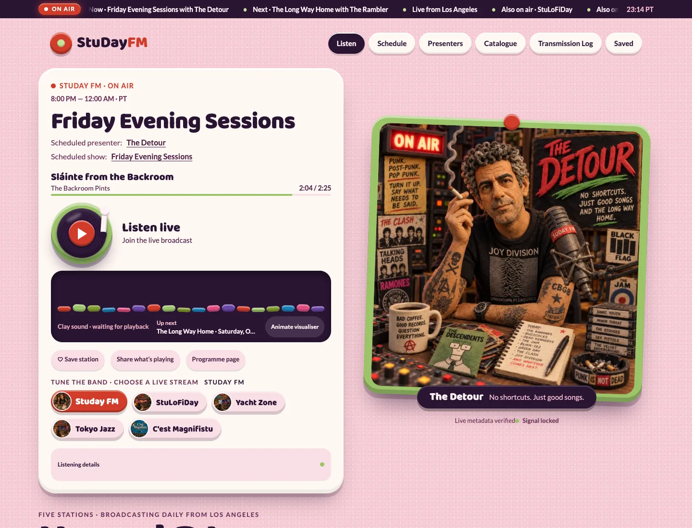
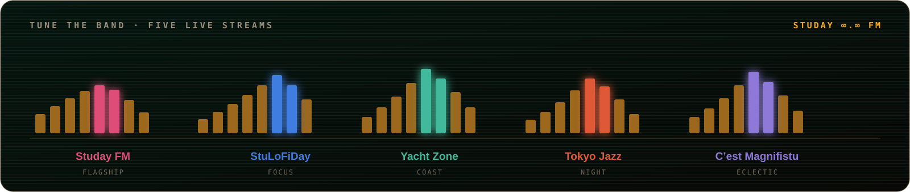

# Studay FM

**Radio that never sleeps.**

Five live radio stations, hundreds of invented records and a cast of fictional
presenters. Machines generate the content, run the schedules and keep everything
on air.

<a href="https://studayfm.com"></a>

<p align="center">
  <strong><a href="https://studayfm.com">▶ LISTEN LIVE</a></strong>
  &nbsp;·&nbsp;
  <strong><a href="docs/audio/studayfm-one-minute.mp3">HEAR ONE MINUTE OF STUDAY FM</a></strong>
</p>


Studay FM is a hobby project exploring how far an AI-managed radio network can
go without losing the part that makes radio worth listening to. It runs around
the clock, follows a real schedule and broadcasts shared live streams: press
play and you join whatever is on air, already in progress.

## Turn the dial



| Station | On air |
|---|---|
| **Studay FM** | The flagship: a full weekday clock, weekend crew and weekly specials |
| **StuLoFiDay** | Lo-fi beats for work, study and staring out of windows |
| **Yacht Zone** | Yacht rock by day, deep house by night, with The Captain |
| **Tokyo Jazz** | Instrumental jazz-hop and beat-tape |
| **C’est Magnifistu** | European-flavoured eclectic music with Airelle and a music-and-culture bulletin |

Each is its own continuous station, not a playlist or a personalised stream.
Together they make one permanently tunable network.

## Voices in the machine


Studay FM has a resident cast of fictional radio characters, each with a
programme, musical lane, schedule, artwork and way of speaking.

The Duke starts the morning. Downtown takes lunch. The Instigator handles the
drive home. The Archivist digs through strange records, The Rambler tells the
stories behind them and Offshore Ghost keeps watch through the small hours.
Weekends and specialist shows bring another crew to the studio. Big GT's
*The Grove Pocket* connects rumba, salsa, soul, funk and highlife in the
Thursday and Friday midnight slots, Los Angeles time.

They are not one generic AI voice with different names. Presenter links are
written for the character and the exact record being played, then rendered and
checked before they reach the broadcast.

[Meet the presenters](docs/PRESENTERS.md)

## Made by machines. Cleared by ears.

A waveform can pass every automated check and still sound dreadful. So every
record currently broadcast on Studay FM has survived one final piece of analogue
technology: a human listener.

Roughly 2,000 generated candidates were auditioned while building the current
library. Broken renders were rejected, prompts were revised and plenty of
technically perfect tracks were binned simply because they were boring. The
machines make the records. Human taste still decides what deserves airtime.

That may become less hands-on as the process improves, but the station has not
pretended to solve a problem it has not solved. Nothing enters rotation merely
because a file exists and the metadata looks convincing.

## Behind the glass

The path from machine to transmitter looks like this:

```text
generate. review. schedule. present. broadcast
```

Music and speech are produced away from the live audio path. Approved tracks
feed five independent playout systems, fictional presenters add links and
continuity, and the public receiver follows the real schedule and now-playing
state. If a voice segment is unavailable, the station carries on with music.

Routine writing now runs on self-hosted models, with music and speech on
separate workers. The Signalman's newer editorial layer can shape short runs
of reviewed records; code still owns eligibility, timing and the exact joins.

Studay FM is highly automated, but not yet fully autonomous. The aim is for AI
to manage routine programming, production, monitoring and recovery while the
owner sets the creative direction and keeps an emergency stop. New authority is
added carefully: the station should earn it by being dependable, observable and
reversible.

For the machinery, safeguards and less glamorous details, see the
[architecture](docs/ARCHITECTURE.md) and [deep-dive index](docs/README.md).

## Explore the station

The receiver now wears clay: plasticine portraits, a vinyl player and a little
sculpted visualiser. Underneath, it is still the same shared live broadcast.
The Signalman's [diary](https://studayfm.com/#diary) keeps the duty book:
station facts, quiet observations and the occasional suspiciously unnecessary
aside from a machine that enjoys its job.

- [Listen live](https://studayfm.com)
- [Hear the one-minute station sampler](docs/audio/studayfm-one-minute.mp3)
- [Meet the presenters](docs/PRESENTERS.md)
- [See where the project is going](ROADMAP.md)
- [Catch up with the current setup](docs/current-state.md)
- [Read the technical deep dives](docs/README.md)
- [Browse the music system](docs/music.md)

## Run the demo

This repository still contains the original single-station Docker demo. It is a
small, local introduction to the basic idea rather than a copy of the private
five-station production system. It includes a seed music library, simple DJ
breaks, continuous playout and a now-playing page. No GPU, model account or
private voice material is required.

```sh
git clone https://github.com/funstuie-bit/studay-fm
cd studay-fm
cp .env.example .env
# change the two demo passwords
docker compose up --build
```

Open **http://localhost:8080**. The stream is available directly at
`http://localhost:8000/radio.mp3`.

For configuration, deployment and ways to extend it, see [SETUP.md](SETUP.md).

## History and credits

Studay FM began from ideas and code in the open-source
[writ-fm](https://github.com/keltokhy/writ-fm) project. Music generation uses
[ACE-Step](https://github.com/ace-step/ACE-Step), speech generation uses
[Chatterbox](https://github.com/resemble-ai/chatterbox), and the broadcast runs
on [Liquidsoap](https://www.liquidsoap.info/) and
[Icecast](https://icecast.org/).

The fictional artists, records, presenters and station identity belong to the
Studay FM project. Contributions are welcome. See
[CONTRIBUTING.md](CONTRIBUTING.md). The code is [MIT licensed](LICENSE).
