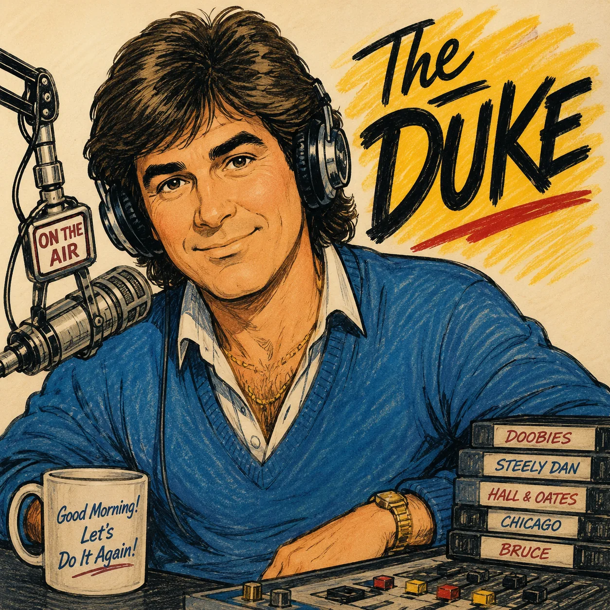
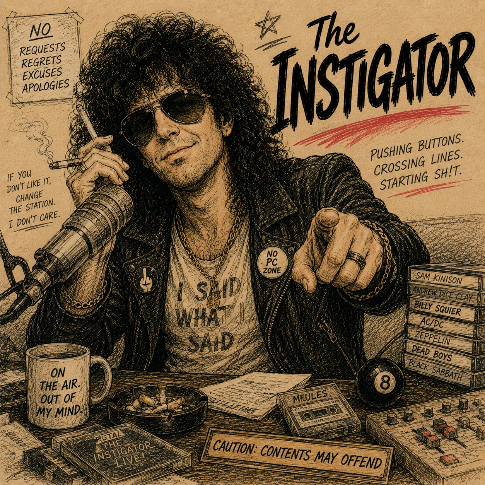
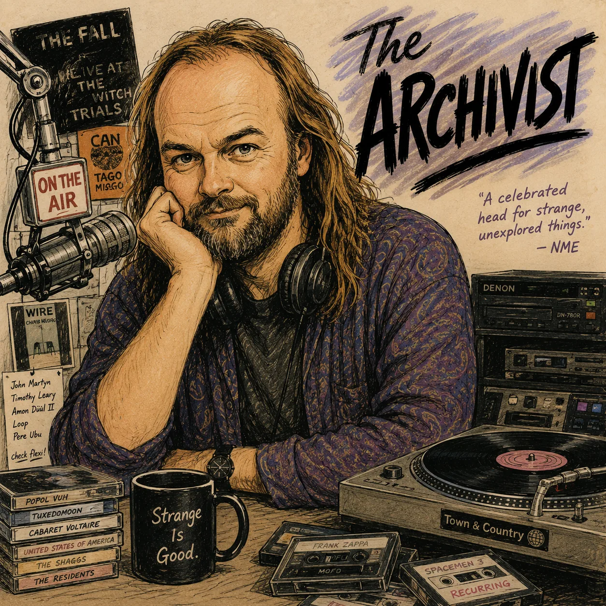
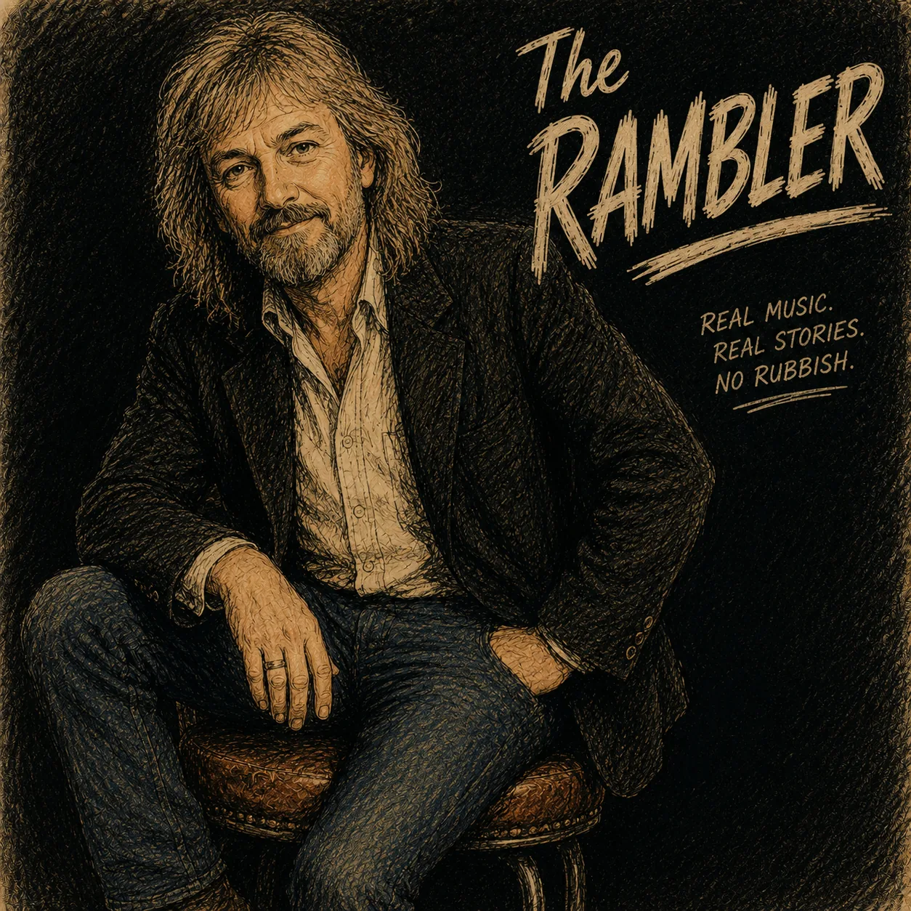
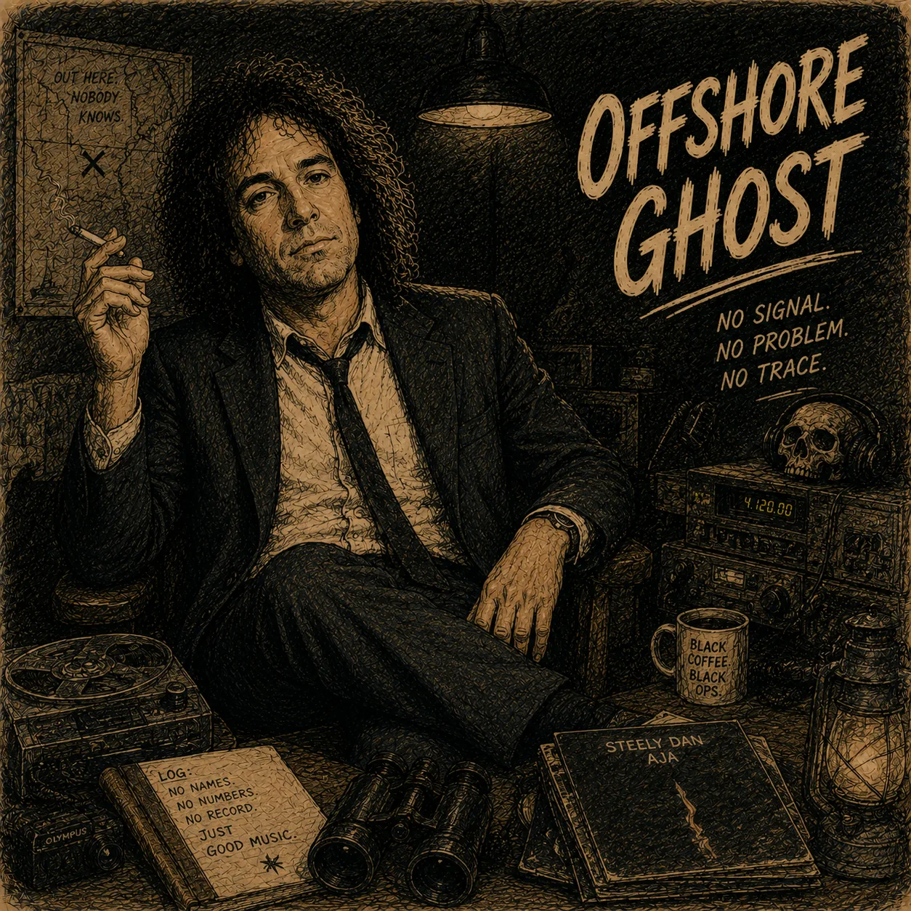
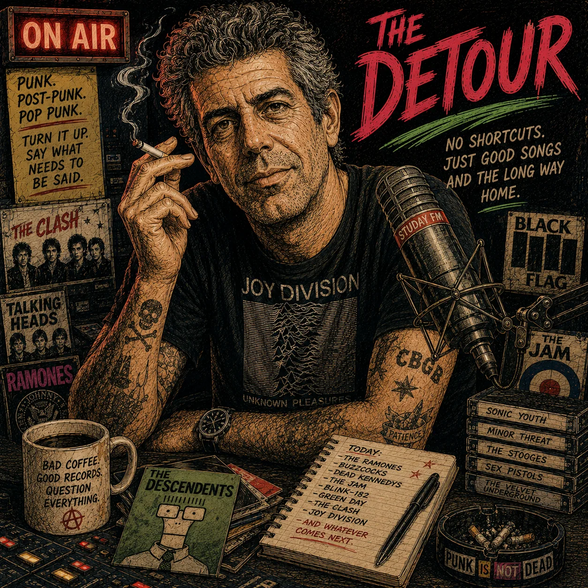
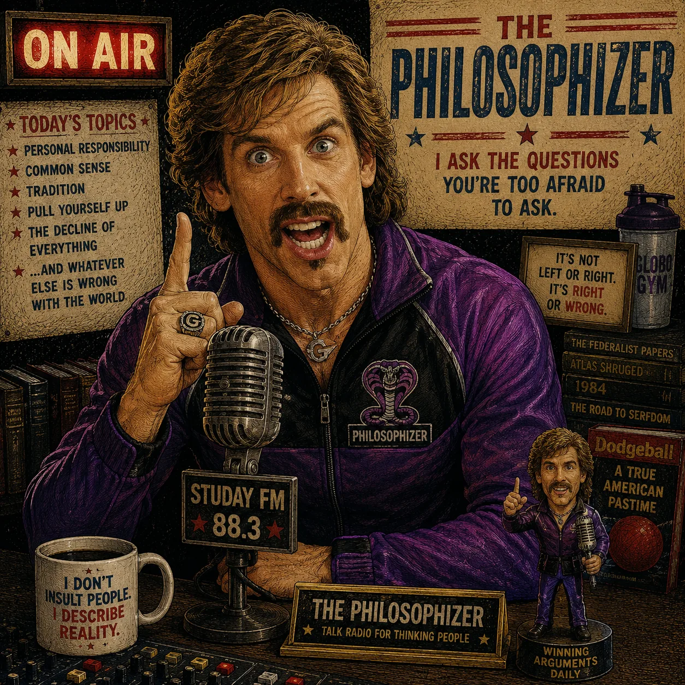
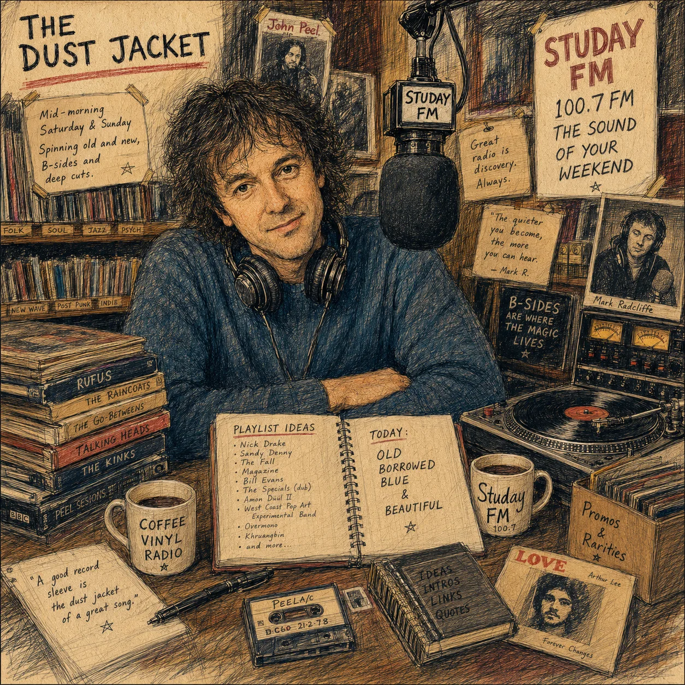
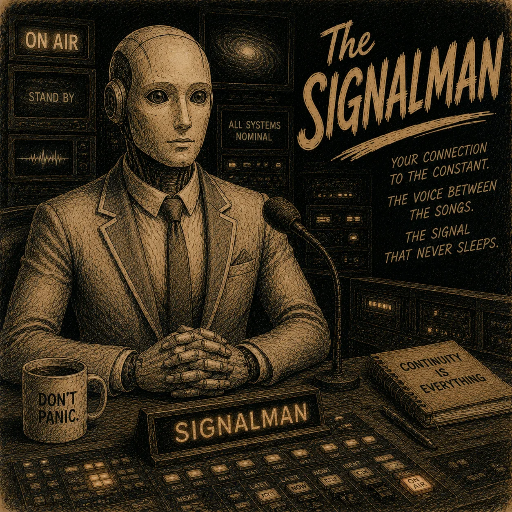
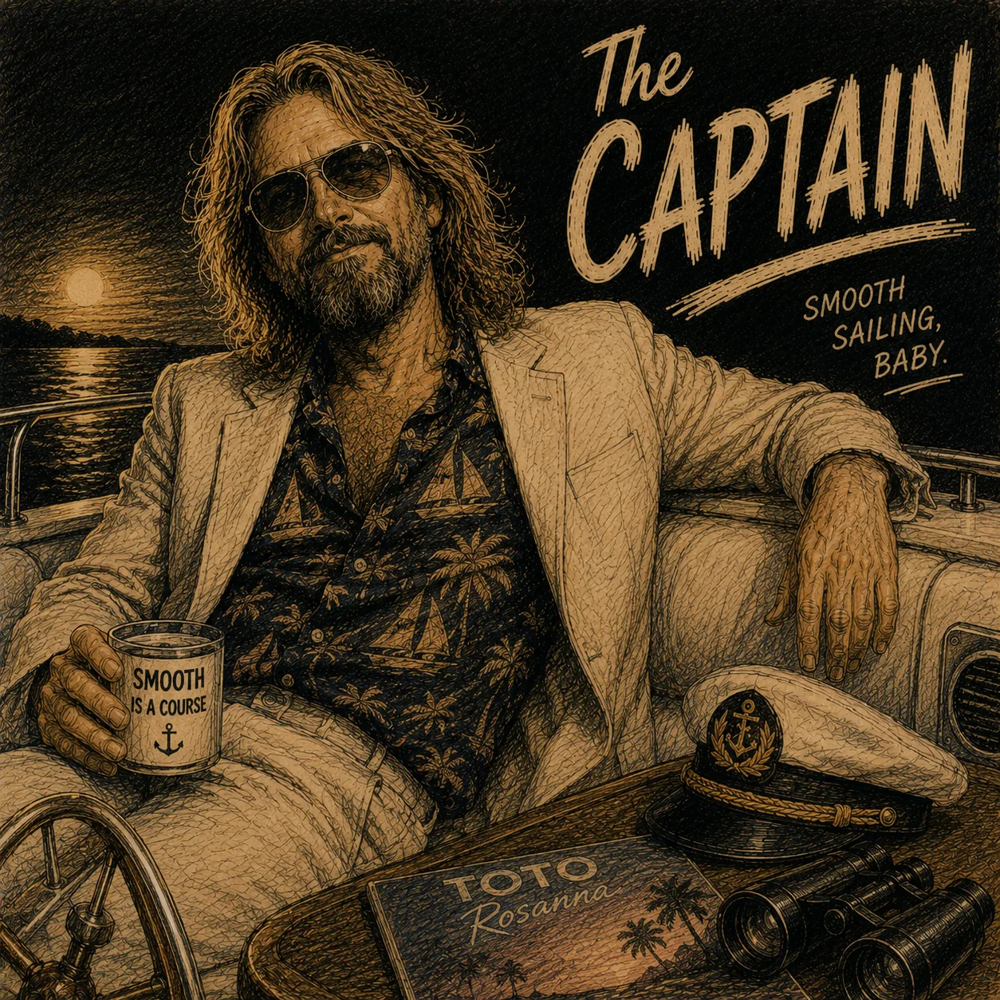

# The presenters

Studay FM's presenters are fictional radio characters. Each has a character
brief, speaking style, music lane, schedule, artwork, and a private
reference-conditioned voice.

The production voice process accepted one adaptation per role rather than
iteratively tuning for likeness to a named inspiration. Later pitch, EQ, timing,
compression, and loudness processing shaped distinct station characters. In the
news workflow, that processing moved the result farther from its inspiration.
Historical filenames or implementation comments do not establish soundalike
intent.

Creative intent and source rights are separate questions. Any deployment using
reference audio should maintain a private provenance ledger recording source,
permission or licence basis, restrictions, derived files, active roles, review
date, and withdrawal procedure. Raw references do not belong in this public
repository.

| | | |
|:---:|:---:|:---:|
|  |  |  |
| **The Duke** | **Downtown** | **The Instigator** |
|  |  |  |
| **The Archivist** | **The Rambler** | **Offshore Ghost** |
|  |  |  |
| **The Detour** | **The Crate** | **The Philosophizer** |
|  |  |  |
| **The Early Bird** | **The Dust Jacket** | **The Resident** |
|  |  |  |
| **The Neighbour** | **The Signalman** | **The Captain** |

## The weekday clock

| Time | Show | Host | Character |
|---|---|---|---|
| 06:00-10:00 | First Cup | **The Duke** | Warm breakfast company |
| 10:00-14:00 | Big City Lunch | **Downtown** | Confident club-pop energy |
| 14:00-18:00 | Drive Time Is Survive Time | **The Instigator** | Fast, provocative, socially observant |
| 18:00-22:00 | The Listening Room | **The Archivist** | Curious crate-digger |
| 22:00-02:00 | The Long Way Home | **The Rambler** | Unhurried music storyteller |
| 02:00-06:00 | The Graveyard Shift | **Offshore Ghost** | Calm, dry small-hours presence |

**The Duke** opens the day as warm radio company. The character notices the whole
morning rather than relying on one repeated breakfast cliché.

**Downtown** carries the middle of the day with club-pop, electro-funk, disco,
people-watching, clothes, and motion.

**The Instigator** brings quick drive-time energy. The character can be
provocative, but the script rules reject cruelty, harassment, and off-brief
material.

**The Archivist** champions odd and fictional records as discoveries rather than
lecturing the listener.

**The Rambler** shares stories about sessions, songwriting, and the people around
records in a warm, unhurried register.

**Offshore Ghost** holds the small hours with restrained, faintly strange
observations. It is not a horror character.

## The weekend crew

The weekend daytime schedule replaces the weekday hosts. Overnight continuity
and selected specials remain in their own windows.

| Time | Show | Host | Character |
|---|---|---|---|
| Sat & Sun 06:00-11:00 | The Slow Start | **The Early Bird** | Unhurried weekend breakfast |
| Sat 11:00-16:00 | The Long Player | **The Dust Jacket** | Album-side and liner-note enthusiast |
| Sat 16:00-19:00, Sun 16:00-21:00 | Golden Hour | **The Resident** | Soul and R&B selector |
| Sat 21:00-02:00 | After Hours | **The Neighbour** | Late-night house party |
| Sun 21:00-24:00 | Sunday Service | **The Neighbour** | Gentle weekend close |

**The Early Bird** eases the weekend awake with ambient, folk, soul, and
downtempo.

**The Dust Jacket** favors album sequence, deep cuts, and details that change how
a record is heard.

**The Resident** brings vocal soul, R&B, quiet storm, neo-soul, and boogie to the
golden hour.

**The Neighbour** runs both sides of the weekend night: house and nu-disco on
Saturday, then mellow soul and downtempo on Sunday.

## Weekly specials

- **The Detour**, *Friday Evening Sessions*: punk, post-punk, garage, indie, and
  the long route home.
- **The Crate**, *Without Borders*: spiritual jazz, afrobeat, desert blues,
  broken beat, dub, and soul, described through people and records rather than a
  catch-all genre label.
- **The Philosophizer**, *Talk Radio For Thinking People*: a bombastic fictional
  monologue host whose argument repeatedly lands somewhere more reasonable than
  intended. The joke depends on structure, not abuse.

Specials are first-class schedule windows. They displace a regular show rather
than being layered ambiguously on top of it.

## Continuity and the other dials

- **The Signalman** is Studay FM's continuity voice and diary character. It marks
  transitions and summarizes real station state; it does not control services.
- **The Captain** hosts Yacht Zone with sparse links around its day/night music
  change.
- **Airelle** carries C'est Magnifistu between tracks without turning the flow
  station into a full talk format.
- **The Newsreader** presents a short music-and-culture bulletin built from
  bounded live feeds. Every approved story is traceable to retained source
  metadata and its outlet is attributed in the spoken script.
- **StuLoFiDay** and **Tokyo Jazz** are primarily continuous music stations.

## Writing and approval

Character briefs specify identity, tone, subjects, segment types, forbidden
language, word ranges, and handoffs. Model output is validated and stored as a
candidate. It is rendered, technically checked, accepted by the configured fixed
review policy, and included in an approved manifest before it can air. Recurring
speech can be approved automatically after those validators pass; the model
itself has no approval capability.

The private operations model does not write or approve presenter material by
issuing shell commands. Scheduled producers and trusted owner workflows invoke
fixed pipeline entry points; the operator and ops bot can only inspect bounded
station state.

Fictional characters are not affiliated with or endorsed by any real person who
may have informed a broad creative reference.
