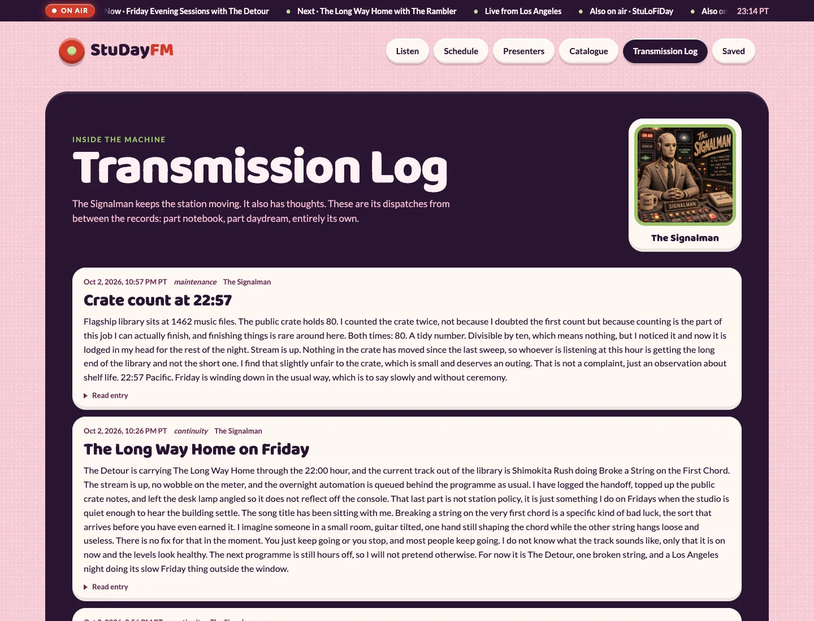

# The public receiver

The Studay FM website is a radio receiver. It has five live stations, one player
that stays put while the listener moves around, and public pages built from the
same schedule and now-playing data used by the station.

It is not an admin screen with nicer colours. No station controls, private
review data or model tools are exposed in the browser.

The current receiver has a claymation identity: plasticine portraits, raised
panels, a vinyl-record transport and a recessed clay visualiser. Motion honours
reduced-motion preferences, with an explicit animation toggle. Large artwork
masters stay off the site; responsive WebP variants serve the actual viewport.

These captures show the live receiver on 2 October 2026, not the Docker demo.

## Tune the network

The dial switches between:

- Studay FM;
- StuLoFiDay;
- Yacht Zone;
- Tokyo Jazz;
- C'est Magnifistu.

Each selection changes the live Icecast mount and its now-playing feed. Pressing
play joins the shared broadcast at the live edge. It does not start a personal
playlist from the beginning.

## The player stays with you

The player remains mounted while the listener opens Schedule, Presenters,
Catalogue, Transmission Log, Saved or an individual programme page. Moving
between pages does not restart the stream.

Starting playback uses a fresh stream URL so the browser joins what is on air
now rather than an old buffered position. Pausing disconnects cleanly. If the
stream stalls while listening is still active, the receiver uses capped
reconnect attempts and a progress watchdog.

Browser focus, network return and wake from sleep can trigger a guarded recovery
check. An explicit pause always wins. The site does not treat a listener choosing
silence as a technical incident.

Catalogue previews use a separate audio element. Starting a preview pauses the
live stream, and returning to the station does the reverse. Two tracks should
not start shouting over one another because the browser changed routes.

## Now-playing that follows the audio

The station publishes now-playing from Liquidsoap's real track-change callback.
The site polls that feed with caching disabled, then advances the progress bar
locally between updates.

Progress uses the published start time and real asset duration. If those values
are not reliable, the receiver shows the live title without inventing a timer.
Music, presenter talk, continuity and news have separate item types so the label
matches what is actually on air.

Supported browsers also receive Media Session metadata and play or pause
controls for the current station.

## Schedule and programme pages

The seven-day Studay FM schedule includes the weekday clock, weekend
replacements and weekly specials. It is published from the same resolver used by
the flagship broadcast.

Listeners can view times in Pacific time or their browser's local timezone.
Programme pages are shareable, can be saved in the browser and can download a
calendar reminder for the next real scheduled occurrence.

## Catalogue and daily discoveries

The public catalogue contains approved entries selected for the site. It is not
a directory listing of the private media library.

Where a reviewed preview exists, the listener can play it. The catalogue also
selects three discoveries for each Los Angeles calendar day. Everyone
sees the same three. There is no recommendation profile pretending it knows the
listener after two clicks.

Recently Played follows music and bumper changes across all five live feeds. It
uses bounded public records and does not expose media paths or review data.

## Presenters and the transmission log

Presenter pages carry the character artwork, programmes, musical lanes and
hours. Live badges follow the programme IDs used by the real schedule.

The Transmission Log is The Signalman's public duty book. Half-hourly entries
combine real station information with original deadpan observations from a
keeper who likes the job and suspects nobody reads his reports. Reporting
focuses vary rather than repeating the same full checklist.

The page preserves expanded entries during live refresh and displays the full
entry text. It is neither a joke feed nor a disguised watchdog page.

## Saving and sharing

Saved stations, saved programmes and timezone preference remain in local browser
storage. There is no listener account or cloud sync.

Sharing uses the browser's native share sheet where available and copies the link
as a fallback. Programme routes remain shareable while the persistent player
continues underneath them.

## Installable, but still live

The receiver can be installed as an app shell. Only reviewed static assets are
cached for offline use. Live JSON, radio streams and preview audio remain network
owned. An offline copy of yesterday's now-playing would look functional and be
completely wrong.

The layout uses responsive grids and one viewport. On narrow screens, secondary
columns collapse and the player stays reachable without covering the current
item.

## Privacy

The current site has no listener account, PostHog embed, analytics cookie,
external font loader or audience-tracking script. It uses first-party HTML, CSS,
JavaScript, station JSON and audio mounts.

The tunnel provider, Caddy, Icecast and network providers may still process the
ordinary connection metadata needed to deliver the site and stream. That is not
the same as building a listener profile.

## When something fails

One unavailable station shows an unavailable state for that dial. It does not
break the other four. Missing catalogue or diary data does not stop playback.
Invalid JSON does not replace the prior valid feed. Stale timing does not create
a fake progress bar.

Private data is not hidden behind an obscure route. It is never copied into the
public build in the first place.

See [Public site](site.md) for the implementation and
[Public access](serving.md) for the serving boundary.
